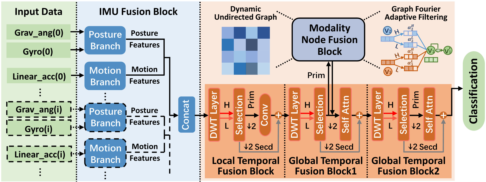
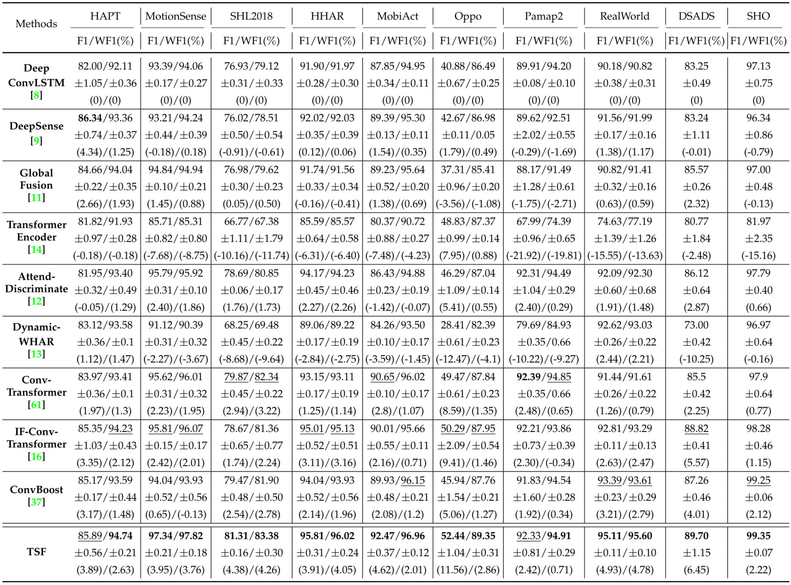

# Triple Spectral Fusion For Sensor-based Human Activity Recognition
This is the pytorch implementation of our paper 'Triple Spectral Fusion For Sensor-based Human Activity Recognition'.



## Algorithm Introduction:

This paper is an extension of our previous conference version [(paper link)](https://dl.acm.org/doi/pdf/10.1145/3534584) in which we proposed an If-ConvTransformer framework for HAR. The additional contributions as compared to our preliminary version are listed as follows:

- We design a modality node fusion block via the adaptive filtering mechanism in graph Fourier domain. This block fuses the homogeneous and heterogeneous  modality information, and thus performs multi-sensor  fusion more effectively than IF-ConvTransformer.

- We construct a temporal information fusion block via  the adaptive wavelet frequency selection mechanism. This block effectively suppresses temporal redundancies, which improves IF-ConvTransformer in terms of  context correlations and computation efficiency.
- We propose a Triple Spectral Fusion (TSF) framework  via specific filtering mechanisms in three spectral domains. Our TSF framework achieves state-of-the-art  performance on ten public HAR datasets.

## Preparation:

**1. Dependencies:**

- Training and testing are performed on a PC with Ubuntu 20.04 system, 2 x NVIDIA 2080Ti GPU.
- Python=3.10, cuda=11.6, PyTorch=1.12.0.
- Other important dependency packages: scikit-learn=1.3.0, pywavelets=1.4.1, dgl=1.1.1.cu116.

**2. Data Loading and Preprocessing:**

- The datasets used in this paper can be easily downloaded according to the links provided by corresponding articles. These links are also provided in the top parts of our data loading codes. 
- Note that, to facilitate data loading, some datasets are transformed to '.npy' or '.csv' formats. Please run the format transformation code before data loading and preprocessing. 
- **Demo for data format transformation:** Run 'src/utils/load_Opportunity_dataset/save_Oppotunity_Dataset_as_csv_files/Save_Oppo_dataset_as_csv.py'. It can be observed that, a 'clean_opp.csv' file is generated in the 'dataset/Opportunity' folder.
- The code for data loading and preprocessing of each dataset are provided in the 'utils' folder.

## Train:

To train a model on specific dataset, you should issue the following command: 

```
Run the 'src/main.py'. Select datasets or classifiers in 'src/constants.py'. Set '--PATTERN' of 'src/constants.py' as 'TRAIN'.
```

Or:

```
python main.py --PATTERN TRAIN --DATASETS (choose datasets, e.g. HAPT Opportunity) --CLASSIFIERS (choose classifers, e.g. IF_ConvTransformer_torch TSF_torch)
```

Note that, the hyperparameters of classifiers on different datasets are put into the 'src/utils/hyperparams.yaml' file.

## Test:

To test a model after training, you should issue the following command: 

```
Run the 'src/main.py'. Select datasets or classifiers in 'src/constants.py'. Set '--PATTERN' of 'src/constants.py' as 'TEST'.
```

Or:

```
python main.py --PATTERN TEST --DATASETS (choose datasets, e.g. HAPT Opportunity) --CLASSIFIERS (choose classifers, e.g. IF_ConvTransformer_torch TSF_torch)
```

**Demo for testing:**

Since we have uploaded the 'TSF_torch' models trained on 'HAPT' and 'Opportunity' datasets, you can directly run testing by:

```
python main.py --PATTERN TEST --DATASETS HAPT Opportunity --CLASSIFIERS TSF_torch
```

## Results: 



## Contact:

**Welcome to raise issues or email to zhangy2658@mail.sysu.edu.cn or yundazhangye@163.com for any question regarding this work.**
